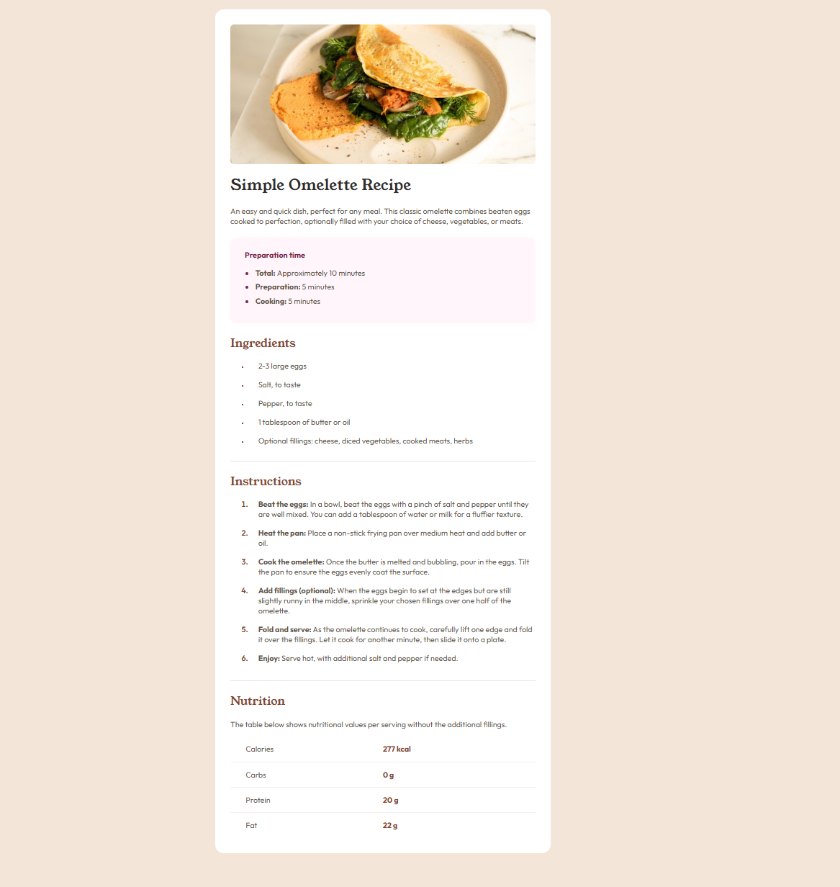

# Frontend Mentor - Social links profile solution

This is a solution to the [Recipe page challenge on Frontend Mentor](https://www.frontendmentor.io/challenges/recipe-page-KiTsR8QQKm). Frontend Mentor challenges help you improve your coding skills by building realistic projects. 

## Table of contents

- [Overview](#overview)
  - [The challenge](#the-challenge)
  - [Screenshot](#screenshot)
  - [Links](#links)
- [My process](#my-process)
  - [Built with](#built-with)
  - [Continued development](#continued-development)
- [Author](#author)

## Overview

### Screenshot

### Links

- Solution URL:  (https://github.com/xluxeo/recipe-page)
- Live Site URL: (https://recipe-page-nine-bay.vercel.app/)

## My process

### Built with

- Semantic HTML5 markup
- CSS custom properties
- Vue.js

### Continued development
- More Vue.js
- Implement SCSS

## Author
- Frontend Mentor - @xluxeo
